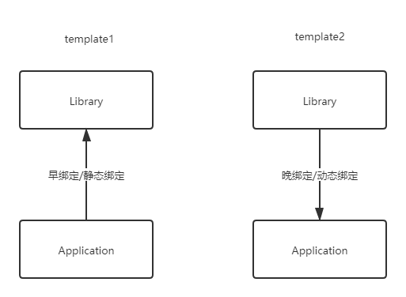

### GOF-23设计模式分类

①从目的来看：

- 创建型模式
- 结构型模式
- 行为型模式

②从范围来看：

- 类模式处理类与子类的静态关系。
- 对象模式处理对象之间的动态关系。

设计模式的要点：寻找**变化点**，在变化点处应用设计模式。

“什么时候、什么地点应用设计模式”比“理解设计模式结构本身”更重要。


### 从封装变化角度对模式分类

- 组件协作:
  • Template Method
  • Observer / Event
  • Strategy
- 单一职责:
  • Decorator
  • Bridge
- 对象创建:
  • Factory Method
  • Abstract Factory
  • Prototype
  • Builder
- 对象性能:
  • Singleton
  • Flyweight
- 接口隔离:
  • Façade
  • Proxy
  • Mediator
  • Adapter
- 状态变化:
  • Memento
  • State
- 数据结构:
  • Composite
  • Iterator
  • Chain of Resposibility
- 行为变化:
  • Command
  • Visitor
- 领域问题:
  • Interpreter


### 重构关键技法

静态→动态

早绑定→晚绑定

继承→组合

编译时依赖→运行时依赖

紧耦合→松耦合


### Template Method模板方法

#### 动机

- 在软件构建过程中，对于某一项任务，它常常有**稳定的整体操作结构**，但各个子步骤却有很多**改变的需求**，或者由于固有的原因（比如框架与应用之间的关系）而无法和任务的整体结构同时实现。
- 如何在确定**稳定操作结构**的前提下，来灵活应对各个子步骤的**变化**或者**晚期**实现需求？

#### 例子

template1

>Library开发人员：
>
>- 开发1,3,5三个步骤
>
>Application开发人员：
>
>- 开发2,4两个步骤
>- 程序主流程

开发1,3,5三个步骤
Application开发人员：

```c++
//程序库开发人员
class Library{
public:
    void Step1()
    {
        //...
	}
    void Step3()
    {
        //...
    }
    void Step5()
    {
        //...
	}
};
```

```c++
//应用程序开发人员
class Application(){
public:
    bool Step2()
    {
        //...
	}
    bool Step4()
    {
        //...
    }
}
int main()
{
    Library lib();
    Application app();
    lib.Step1();
    if(app.Step2())
    {
        lib.Step3();
    }
    for(int i=0;i<4;i++)
    {
        app.Step4();
    }
    lib.Step5();
    return 0;
}
```


template2

>Library开发人员：
>
>- 开发1,3,5三个步骤
>- 程序主流程
>
>Application开发人员：
>
>- 开发2,4两个步骤

应用程序开发人员不需要知道主流程了。

```c++
//程序库开发人员
class Library{
public:
    void Run(){
        Step1();
        if(Step2())//虚函数的多态
        {
            Step3();
        }
        for(int i=0;i<4;i++)
    	{
        	Step4();//虚函数的多态
    	}
        Step5();
    }
    virtual ~Library();//基类采用virtual虚析构函数是为了防止内存泄漏
    //假设基类中采用的是非虚析构函数，当删除基类指针指向的派生类对象时就不会触发动态绑定，因而只会调用基类的析构函数，而不会调用派生类的析构函数。
    //不会有人不知道吧不会吧不会吧，哦是我自己啊，那没事了。
protected:
    void Step1()//稳定
    {
        //...
	}
    void Step3()//稳定
    {
        //...
    }
    void Step5()//稳定
    {
        //...
	}
    virtual bool Step2()=0;//给应用程序提供的可实现的方法，同时也是变化点
    virtual bool Step4()=0;
};
```

```c++
//应用程序开发人员
class Application():public Library{
public:
    virtual bool Step2()
    {
        //...
	}
    virtual bool Step4()
    {
        //...
    }
}
int main()
{
    Library *pLib=new Application();//这里声明为基类指针也非常得妙，因为动态绑定所以遇到Library的虚函数就会去找Application里的Step2()和Step4()的实现。
    //这个框架可被Application继承实现，自然也可以被Application2去继承实现。
    lib->Run();
    delete pLib;
    return 0;
}
```

举例：QT里的QThread类



template1是一种早绑定的做法，即通过头文件早早地被引用，然后在主函数流程里被调用，属于一种静态的做法。

而template2通过虚函数（即动态绑定），直到运行的时候才去根据虚函数表找到相应的实现方法。


#### 模式定义

定义一个操作中的算法的骨架 (稳定),**而将一些步骤延迟**
**(变化)到子类中。**Template Method使得子类可以不改变(**复用**)一个**算法的结构**即可重定义(override **重写)该算法的某些特定步骤。**

在面向对象的语言里，我们提到**延迟到子类**一般指，定义一个虚函数，让子类实现（重写）这个虚函数。

适合使用模板方法必须有一个**稳定的骨架结构**可以被重用。

> 个人总结：模板方法就是定好一个固定的框架流程和一些固定的步骤，而那些需要变化的步骤则封装成虚函数接口方法，让具体业务类去实现。模板方法是非常通用的框架设计模式。


#### 要点总结

- Template Method 模式是一种**非常基础性**的设计模式，在面向对象系统中有着大量的应用。她用最简单的机制（虚函数的多态型）为很多应用程序框架提供了灵活的**扩展点**（继承+多态），是代码复用的基本实现结构。
- 除了可以**灵活应对子步骤**的变化外，“不要调用我，让我调用你”的**反向控制结构**是Template Method的典型应用。
- 在具体实现方面，被Template Method调用虚方法可以具有实现，也可以没有任何实现（抽象方法，纯虚方法），但一般推荐为将他们设置为protected方法。


#### 题外话

设计模式应用的时候，一定要是存在稳定和变化的两个部分，如果极端地假设全是变化或全是稳定，则所有设计模式都没有意义。设计模式的最大作用，就是在稳定和变化之间，寻找隔离点，然后分离它们，从而来管理变化。